# ClickPsico

Sistema de prontuário eletrônico para o Serviço-Escola de Psicologia.

## Sobre o projeto

O ClickPsico foi pensado para ajudar estudantes, supervisores, psicólogos técnicos e pacientes na organização dos atendimentos psicológicos.

## Diagramas do sistema

Os diagramas abaixo foram convertidos para imagens SVG e aparecem diretamente no README. Os arquivos `.drawio` continuam na pasta do projeto caso seja necessário editar os desenhos no diagrams.net.

### Diagrama de casos de uso

### Diagrama entidade-relacionamento

## Arquivos originais

- `Diagrama de casos de uso - Prontuário eletônico.drawio`: arquivo editável do diagrama de casos de uso.
- `Diagrama DER - ClickPsico.drawio`: arquivo editável do diagrama entidade-relacionamento.

## Página inicial

A página inicial está em `index.html` e utiliza `style.css` para os estilos e `script.js` para futuras interações.
